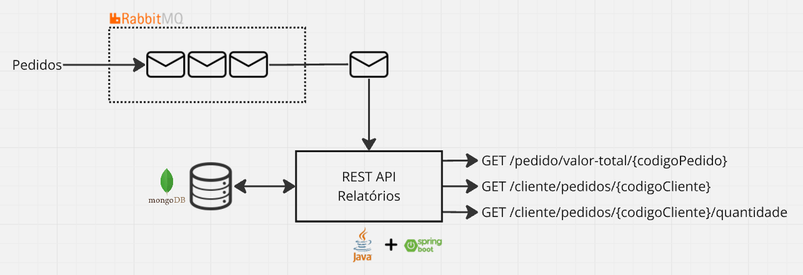
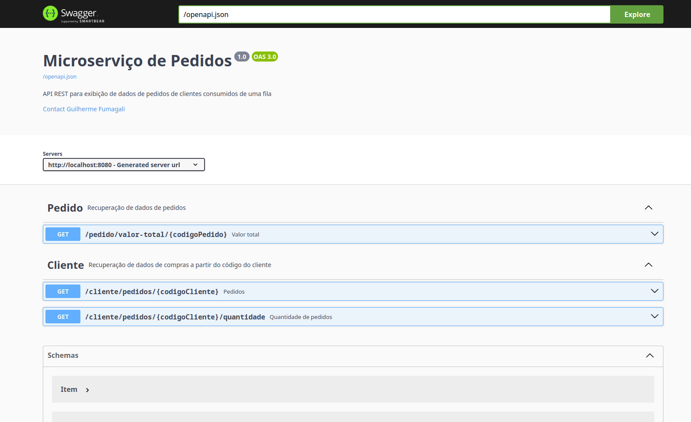
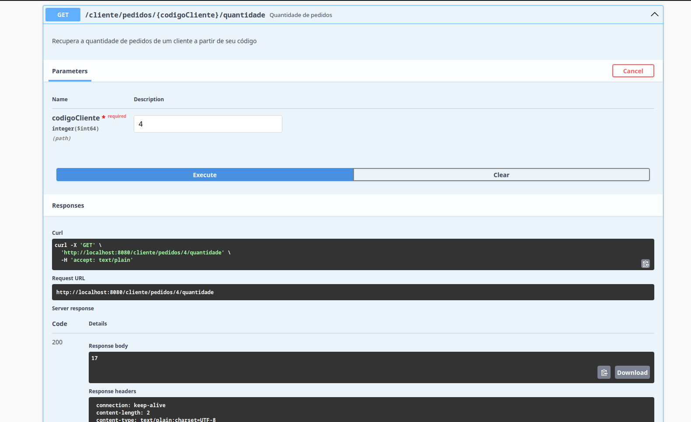

> Aplicação desenvolvida para _case_ técnico
> 
> Imagem no DockerHub: https://hub.docker.com/r/gfumagali/micro-servico-pedidos/
> 
> Guia rápido: consulte a seção [**Início rápido**](#início-rápido)

# Micro serviço de processamento de pedidos

<!-- TOC -->
* [Micro serviço de processamento de pedidos](#micro-serviço-de-processamento-de-pedidos)
  * [Visão geral](#visão-geral)
    * [Dados de entrada](#dados-de-entrada)
      * [Restrições](#restrições)
  * [**Início rápido**](#início-rápido)
  * [Repositório](#repositório)
  * [Serviços de apoio](#serviços-de-apoio)
  * [Variáveis de ambiente](#variáveis-de-ambiente)
  * [Executando a aplicação](#executando-a-aplicação)
    * [Versão de demonstração com Docker Compose](#versão-de-demonstração-com-docker-compose)
    * [Build com Gradle](#build-com-gradle)
    * [Gerar imagem Docker](#gerar-imagem-docker)
  * [Carga inicial de dados](#carga-inicial-de-dados)
    * [Script de geração de pedidos](#script-de-geração-de-pedidos)
    * [Carga inicial no ambiente de demonstração](#carga-inicial-no-ambiente-de-demonstração)
  * [Utilizar a API na interface Swagger](#utilizar-a-api-na-interface-swagger)
<!-- TOC -->

## Visão geral

Micro serviço que atua como intermediário entre um sistema de vendas e uma solução de geração de relatórios.
Sendo responsável por extrair de pedidos as informações de:

- Valor total de um pedido;
- Quantidade de pedidos realizados por um cliente;
- Lista de pedidos realizados por um cliente.

Tornando acessível esses dados por endpoints em uma _API REST_. A figura abaixo ilustra o funcionamento do micro
serviço.



Essa aplicação foi desenvolvida com o _JDK Java_ versão 21 com o [_Spring Framework_](https://spring.io/), com a
ferramenta de build [_Gradle_](https://gradle.org/).

**A aplicação para ser executada precisa de no mínimo um SO com Git, Docker e Docker Compose instalados.**

Ambiente de desenvolvimento:

- OS: Manjaro Linux x86_64;
- Kernel: 6.6.46-1-MANJARO;
- Docker version 27.1.1;
- Docker Compose version 2.29.2.

### Dados de entrada

O método inscrito na fila de pedidos espera um dado no formato `application/json` com a seguinte estrutura:

```json
{
  "codigoPedido": "long",
  "codigoCliente": "long",
  "itens": [
    {
      "produto": "string",
      "quantidade": "long",
      "preco": "double"
    }
  ]
}
```

#### Restrições

* Todos os campos são obrigatórios;
* Se o campo `codigoPedido` for repetido, o pedido anterior será **sobrescrito**;
* Se qualquer campo for inválido quanto aos tipos e regras de entrada listadas abaixo, o pedido será **descartado**.

| Campo           | Restrição                                                         |
|-----------------|-------------------------------------------------------------------|
| _codigoPedido_  | Positivo ou zero                                                  |
| _codigoCliente_ | Positivo ou zero                                                  |
| _itens_         | Não vazio, pelo menos um item                                     |
| _produto_       | Não vazio, pelo menos um caractere                                |
| _quantidade_    | Positivo maior que zero                                           |
| _preco_         | Positivo ou zero, com no máximo dez dígitos e duas casas decimais |

## **Início rápido**

Instância da aplicação e serviços de apoio:

```bash
git clone https://github.com/Guilherme-Fumagali/micro-servico-pedidos.git
cd micro-servico-pedidos

docker compose -f deploy/demo-environment/docker-compose.yaml up
```

Popula a fila de pedidos com 1000 pedidos de clientes de código variando entre 1 e 100 aleatoriamente:

```bash
docker exec -it micro-servico-pedidos /app/scripts/produtor_pedidos.sh 100 1000 10
```

Acesse a documentação da _API_
em [http://localhost:8080/swagger-ui/index.html](http://localhost:8080/swagger-ui/index.html).

## Repositório

As seções abaixo detalham como configurar e executar a aplicação. Antes, clone o repositório:

```bash
git clone https://github.com/Guilherme-Fumagali/micro-servico-pedidos.git
cd micro-servico-pedidos
```

## Serviços de apoio

**Obs: Você pode pular essa seção se deseja apenas usar a aplicação
na [versão de demonstração](#Versão-de-demonstração-com-Docker-Compose).**

A aplicação usa um Banco de Dados orientado a documentos [_MongoDB_](https://www.mongodb.com/) para armazenar os
pedidos, e um serviço de mensageria [_RabbitMQ_](https://www.rabbitmq.com/) para receber os pedidos.

As versões listadas abaixo foram usadas durante o desenvolvimento estão declaradas no `docker-compose`
do [ambiente de desenvolvimento](deploy/dev-environment/docker-compose.yaml).

| Nome     | Versão      | Usuário | Senha    | Portas                               |
|----------|-------------|---------|----------|--------------------------------------|
| MongoDB  | 7.{:latest} | root    | password | 27017                                |
| RabbitMQ | 3.{:latest} | user    | password | 5672 (dados) e 15672 (gerenciamento) |

Para instanciar esse ambiente, execute:

```bash
docker compose -f deploy/dev-environment/docker-compose.yaml up
```

Por _default_, os valores padrões definidos na aplicação são os mesmos listados acima. Se deseja usar um ambiente
diferente, configure as [variáveis de ambiente](#Variáveis-de-ambiente) apropriadas.

## Variáveis de ambiente

Modifique as variáveis de ambiente para configurar o micro serviço. As variáveis disponíveis são:

| Nome                  | Descrição                     | Valor default | Restrições                                     |
|-----------------------|-------------------------------|---------------|------------------------------------------------|
| _RABBITMQ_HOST_       | Endereço do servidor RabbitMQ | localhost     | Obrigatório. String não vazia.                 |
| _RABBITMQ_PORT_       | Porta do servidor RabbitMQ    | 5672          | Obrigatório. Inteiro positivo menor que 65536. |
| _RABBITMQ_USERNAME_   | Usuário do RabbitMQ           | user          | Opcional.                                      |
| _RABBITMQ_PASSWORD_   | Senha do RabbitMQ             | password      | Opcional.                                      |
| _RABBITMQ_QUEUE_NAME_ | Nome da fila de pedidos       | pedidos       | Obrigatório. String não vazia.                 |
| _MONGODB_HOST_        | Endereço do servidor MongoDB  | localhost     | Obrigatório. String não vazia.                 |
| _MONGODB_PORT_        | Porta do servidor MongoDB     | 27017         | Obrigatório. Inteiro positivo menor que 65536. |
| _MONGODB_USERNAME_    | Usuário do MongoDB            | root          | Opcional.                                      |
| _MONGODB_PASSWORD_    | Senha do MongoDB              | password      | Opcional.                                      |
| _MONGODB_DATABASE_    | Nome do banco de dados        | pedidos       | Obrigatório. String não vazia.                 |

Há um [arquivo `.env.example` no repositório](deploy/.env.example) que pode ser usado como base para criar um arquivo
`.env` com as variáveis de ambiente.

## Executando a aplicação

### Versão de demonstração com Docker Compose

O repositório está configurado para gerar e publicar a imagem correspondente a _branch_ `main`
no [Docker Hub](https://hub.docker.com/r/gfumagali/micro-servico-pedidos/).

O arquivo o [`docker-compose` em `deploy/demo-environment/](deploy/demo-environment/docker-compose.yaml) está declarado
para usar essa imagem junto aos serviços de apoio. Para subir o ambiente de demonstração, execute:

```bash
docker compose -f deploy/demo-environment/docker-compose.yaml up
```

Confira se a aplicação está funcionando acessando a documentação da _API_
em [http://localhost:8080/swagger-ui/index.html](http://localhost:8080/swagger-ui/index.html), e o _RabbitMQ_
em [http://localhost:15672](http://localhost:15672).

### Build com Gradle

Para compilar e executar a aplicação localmente, execute:

```bash
./gradlew bootRun 
```

ou, se deseja rodar os testes antes:

```bash
./gradlew test bootRun
```   

### Gerar imagem Docker

Para gerar a imagem Docker da aplicação, execute:

```bash
docker build -t micro-servico-pedidos .

docker run \
    -e RABBITMQ_HOST=localhost \
    -e RABBITMQ_PORT=5672 \
    -e RABBITMQ_USERNAME=user \
    -e RABBITMQ_PASSWORD=password \
    -e RABBITMQ_QUEUE_NAME=pedidos \
    -e MONGODB_HOST=localhost \
    -e MONGODB_PORT=27017 \
    -e MONGODB_USERNAME=root \
    -e MONGODB_PASSWORD=password \
    -e MONGODB_DATABASE=pedidos \
    --network host \
    micro-servico-pedidos
```

Altere a flag `--network host` para `-p 8080:8080` se deseja mapear a porta da aplicação. Nesse caso, confira a conexão
entre o container e os serviços de apoio.

## Carga inicial de dados

### Script de geração de pedidos

Para facilitar o teste da aplicação, foi criado um arquivo shell `produtor_pedidos.sh` que envia pedidos para a fila
gerados aleatoriamente com parâmetros do SO.

Localizado na em [scripts/produtor_pedidos.sh](scripts/produtor_pedidos.sh). Depende do binário
`amqp-publish` (https://manpages.ubuntu.com/manpages/focal/en/man1/amqp-publish.1.html).

A execução do script precisa dos argumentos:

- `id_cliente_max`: Número máximo de codigoCliente a serem gerados;
- `quantidade_pedidos`: Número de pedidos a serem gerados;
- `quantidade_maxima_itens_por_pedido`: Número máximo de itens por pedido.

Assim, para gerar 10 pedidos de clientes com código VARIANDO entre 1 e 10, com no MÁXIMO 5 itens por pedido, execute:

```bash
./produtor_pedidos.sh 10 10 5
```

Para ajuda:

```bash
./produtor_pedidos.sh -h
```

### Carga inicial no ambiente de demonstração

A imagem está configurada com os pacote necessários. Assim, para gerar o exemplo acima, execute:

```bash
docker exec -it micro-servico-pedidos /app/scripts/produtor_pedidos.sh 10 10 5
```

## Utilizar a API na interface Swagger

Com a aplicação rodando, acesse a documentação da _API_
em [http://localhost:8080/swagger-ui/index.html](http://localhost:8080/swagger-ui/index.html).



A _API_ possui três _endpoints_:

- `GET /pedidos/valor-total/{codigoPedido}`: Retorna o valor total de um pedido;
- `GET /cliente/pedidos/{codigoCliente}`: Retorna a lista de pedidos de um cliente;
- `GET /cliente/quantidade-pedidos/{codigoCliente}`: Retorna a quantidade de pedidos de um cliente.

Para testar, clique no _endpoint_ desejado, clique em `Try it out`, insira o valor desejado e clique em `Execute`. O
resultado será exibido na caixa de resposta.


